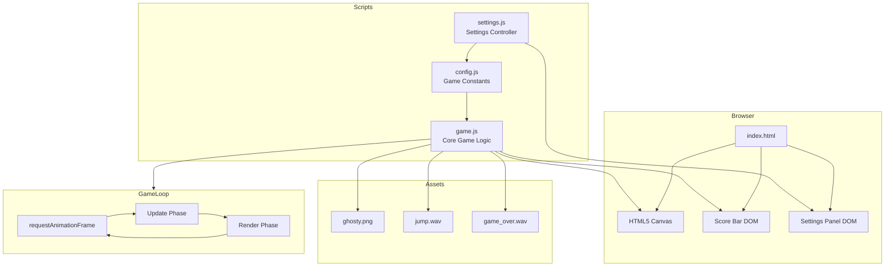
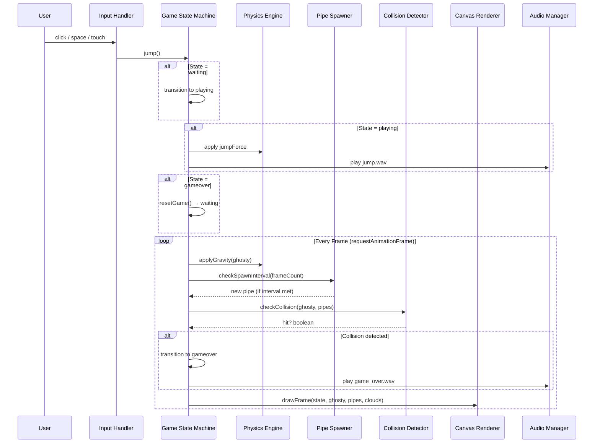

# Design Document: Flappy Kiro

## Overview

Flappy Kiro is an arcade-style endless-runner browser game built with vanilla HTML5 Canvas and JavaScript. The player controls Ghosty, a friendly ghost character, by tapping or clicking to "flap" upward against gravity, navigating through gaps in vertically-oriented pipe obstacles that scroll from right to left.

The game follows a classic game loop architecture with a finite state machine managing transitions between waiting, playing, and game-over states. All rendering is performed on a single HTML5 Canvas element using the 2D rendering context. The game requires no build tools, server, or external frameworks — it runs by opening `index.html` directly in a browser.

The system is designed around a centralized configuration object (`CONFIG`) that exposes all tunable physics and gameplay constants, enabling real-time adjustment via a settings panel without code changes.

## Architecture



### Component Interaction Flow



## Components and Interfaces

### Component 1: Configuration (config.js)

**Purpose**: Centralized store for all tunable game constants. Acts as the single source of truth for physics, dimensions, and gameplay parameters.

**Interface**:
```javascript
const CONFIG = {
    // Physics
    gravity: number,        // Downward acceleration per frame (default: 0.4)
    jumpForce: number,      // Upward velocity on flap (default: -7, negative = up)

    // Pipes
    pipeWidth: number,      // Horizontal width of pipe obstacles (default: 70px)
    pipeGap: number,        // Vertical gap between top and bottom pipes (default: 160px)
    pipeSpeed: number,      // Horizontal scroll speed of pipes (default: 2.5 px/frame)
    pipeSpawnInterval: number, // Frames between pipe spawns (default: 180)

    // Ghosty
    ghostySize: number,     // Width and height of ghost sprite (default: 36px)
    hitboxInset: number,    // Collision forgiveness inset in px (default: 4)

    // Background
    cloudCount: number,     // Number of background clouds (default: 5)
    cloudMinSpeed: number,  // Minimum cloud scroll speed (default: 0.3)
    cloudMaxSpeed: number,  // Maximum cloud scroll speed (default: 0.8)

    // Canvas
    canvasWidth: number,    // Canvas element width (default: 800)
    canvasHeight: number    // Canvas element height (default: 500)
};
```

**Responsibilities**:
- Provide default values for all game parameters
- Be mutable at runtime (settings panel writes directly to CONFIG)
- Serve as the contract between game logic and settings UI

---

### Component 2: Game Engine (game.js)

**Purpose**: Core game logic including the game loop, physics simulation, entity management, rendering, and state transitions.

**Interface**:
```javascript
// State
let ghosty: GhostyEntity
let pipes: PipeEntity[]
let clouds: CloudEntity[]
let score: number
let highScore: number
let gameState: 'waiting' | 'playing' | 'gameover'
let frameCount: number

// Core Functions
function gameLoop(): void           // Main loop (called via requestAnimationFrame)
function jump(): void               // Handle player input
function resetGame(): void          // Reset all state to initial values
function spawnPipe(): void          // Create a new pipe at right edge
function checkCollision(): boolean  // Test ghosty against pipes and boundaries
function gameOver(): void           // Transition to gameover state

// Rendering Functions
function drawGhosty(): void         // Render ghost character with rotation
function drawPipe(pipe): void       // Render a single pipe pair
function drawCloud(cloud): void     // Render a background cloud

// Utility
function initClouds(): void         // Initialize cloud array
function updateScoreBar(): void     // Sync DOM score display
```

**Responsibilities**:
- Run the game loop at ~60fps via requestAnimationFrame
- Manage game state transitions (waiting → playing → gameover → waiting)
- Apply physics (gravity, velocity) each frame
- Spawn and scroll pipe obstacles
- Detect collisions and trigger game over
- Render all entities to canvas
- Handle input events (keyboard, mouse, touch)
- Persist high score to localStorage

---

### Component 3: Settings Controller (settings.js)

**Purpose**: Connects the settings panel UI (sliders) to the CONFIG object for live tuning.

**Interface**:
```javascript
// Slider binding definition
interface SliderBinding {
    id: string,          // DOM element ID of the range input
    display: string,     // DOM element ID of the value display span
    key: string,         // CONFIG property key to update
    transform: (value: string) => number  // Convert slider string to CONFIG value
}

// Functions
function resetDefaults(): void  // Restore CONFIG to initial values, update all sliders
```

**Responsibilities**:
- Bind slider input events to CONFIG property updates
- Display current values next to each slider
- Provide reset-to-defaults functionality
- Immediately apply ghostySize changes to the live entity

---

## Data Models

### GhostyEntity

```javascript
/**
 * Represents the player-controlled ghost character.
 */
const ghosty = {
    x: number,         // Horizontal position (fixed at 120px from left)
    y: number,         // Vertical position (updated by physics)
    width: number,     // Sprite width (from CONFIG.ghostySize)
    height: number,    // Sprite height (from CONFIG.ghostySize)
    velocity: number   // Current vertical velocity (positive = down)
};
```

**Validation Rules**:
- `x` is constant during gameplay (120px)
- `y` must be within [0, canvasHeight] (collision triggers game over otherwise)
- `velocity` is unbounded but clamped visually via rotation angle

### PipeEntity

```javascript
/**
 * Represents a pair of top/bottom pipe obstacles.
 */
const pipe = {
    x: number,          // Horizontal position of pipe left edge
    topHeight: number,  // Height of the top pipe (gap starts here)
    scored: boolean     // Whether this pipe has been counted for score
};
```

**Validation Rules**:
- `x` starts at `canvasWidth` and decreases by `pipeSpeed` each frame
- `topHeight` must be within [60, canvasHeight - pipeGap - 60]
- `scored` flips to true once pipe passes ghosty's x position
- Pipe is removed when `x + pipeWidth < -10`

### CloudEntity

```javascript
/**
 * Represents a decorative background cloud.
 */
const cloud = {
    x: number,      // Horizontal position
    y: number,      // Vertical position (upper 60% of canvas)
    width: number,  // Cloud width (60-100px, randomized)
    speed: number   // Scroll speed (between cloudMinSpeed and cloudMaxSpeed)
};
```

**Validation Rules**:
- `y` is within [0, canvasHeight * 0.6]
- `width` is within [60, 100]
- Cloud wraps to right edge when fully off-screen left

### GameState (Finite State Machine)

```javascript
/**
 * Game state transitions:
 *   'waiting'  --[jump()]--> 'playing'
 *   'playing'  --[collision]--> 'gameover'
 *   'gameover' --[jump()]--> 'waiting' (via resetGame)
 */
type GameState = 'waiting' | 'playing' | 'gameover';
```

---

## Algorithmic Pseudocode

### Main Game Loop Algorithm

```javascript
/**
 * ALGORITHM: gameLoop
 * INPUT: none (reads global state)
 * OUTPUT: renders one frame to canvas, schedules next frame
 *
 * PRECONDITIONS:
 *   - Canvas context (ctx) is initialized
 *   - CONFIG is loaded and valid
 *   - ghosty, pipes, clouds arrays exist
 *
 * POSTCONDITIONS:
 *   - One frame rendered to canvas
 *   - All entity positions updated (if playing)
 *   - Collision checked (if playing)
 *   - Next frame scheduled via requestAnimationFrame
 *
 * LOOP INVARIANT:
 *   - gameState is always one of: 'waiting', 'playing', 'gameover'
 *   - All pipes in array have x > -pipeWidth (off-screen pipes removed)
 */
function gameLoop() {
    // Phase 1: Clear and draw background
    clearCanvas(skyBlueColor)
    updateAndDrawClouds(clouds)

    // Phase 2: Update (only when playing)
    if (gameState === 'playing') {
        // Apply physics
        ghosty.velocity += CONFIG.gravity
        ghosty.y += ghosty.velocity

        // Spawn pipes on interval
        frameCount++
        if (frameCount % CONFIG.pipeSpawnInterval === 0) {
            spawnPipe()
        }

        // Update pipes (move left, score, cull)
        for each pipe in pipes (reverse iteration):
            pipe.x -= CONFIG.pipeSpeed
            if (!pipe.scored && pipe.x + CONFIG.pipeWidth < ghosty.x):
                pipe.scored = true
                score++
            if (pipe.x + CONFIG.pipeWidth < -10):
                remove pipe from array

        // Check collision
        if (checkCollision()):
            gameOver()
    }

    // Phase 3: Render entities
    drawPipes(pipes)
    drawGhosty()
    drawOverlay(gameState)

    // Phase 4: Schedule next frame
    requestAnimationFrame(gameLoop)
}
```

### Physics Update Algorithm

```javascript
/**
 * ALGORITHM: applyPhysics
 * INPUT: ghosty entity, CONFIG constants
 * OUTPUT: updated ghosty.y and ghosty.velocity
 *
 * PRECONDITIONS:
 *   - ghosty.velocity is a finite number
 *   - CONFIG.gravity > 0
 *
 * POSTCONDITIONS:
 *   - ghosty.velocity increased by CONFIG.gravity (simulates downward pull)
 *   - ghosty.y increased by new velocity (position updated)
 *   - No clamping applied (collision detection handles boundaries)
 *
 * PHYSICS MODEL:
 *   Semi-implicit Euler integration:
 *     v(t+1) = v(t) + gravity
 *     y(t+1) = y(t) + v(t+1)
 */
function applyPhysics(ghosty) {
    ghosty.velocity += CONFIG.gravity   // Accelerate downward
    ghosty.y += ghosty.velocity         // Update position
}
```

### Collision Detection Algorithm

```javascript
/**
 * ALGORITHM: checkCollision
 * INPUT: ghosty entity, pipes array, canvas dimensions
 * OUTPUT: boolean (true if collision detected)
 *
 * PRECONDITIONS:
 *   - ghosty has valid x, y, width, height
 *   - Each pipe has valid x, topHeight
 *   - CONFIG.hitboxInset >= 0
 *   - CONFIG.pipeGap > 0
 *
 * POSTCONDITIONS:
 *   - Returns true if ghosty overlaps any boundary or pipe
 *   - Returns false if ghosty is in safe space
 *   - No state mutation (pure query)
 *
 * ALGORITHM:
 *   1. Check boundary collision (floor/ceiling)
 *   2. For each pipe, check AABB overlap with inset hitbox
 *   3. Early return on first collision found
 */
function checkCollision() {
    const inset = CONFIG.hitboxInset

    // Boundary check: floor and ceiling
    if (ghosty.y + ghosty.height > canvas.height) return true  // Floor
    if (ghosty.y < 0) return true                               // Ceiling

    // Pipe collision: AABB with inset
    for (let pipe of pipes) {
        const ghostLeft   = ghosty.x + inset
        const ghostRight  = ghosty.x + ghosty.width - inset
        const ghostTop    = ghosty.y + inset
        const ghostBottom = ghosty.y + ghosty.height - inset

        const pipeLeft  = pipe.x
        const pipeRight = pipe.x + CONFIG.pipeWidth

        // Horizontal overlap test
        if (ghostRight > pipeLeft && ghostLeft < pipeRight) {
            // Vertical overlap with top pipe
            if (ghostTop < pipe.topHeight) return true
            // Vertical overlap with bottom pipe
            if (ghostBottom > pipe.topHeight + CONFIG.pipeGap) return true
        }
    }

    return false
}
```

### Pipe Spawning Algorithm

```javascript
/**
 * ALGORITHM: spawnPipe
 * INPUT: canvas dimensions, CONFIG constants
 * OUTPUT: new PipeEntity appended to pipes array
 *
 * PRECONDITIONS:
 *   - CONFIG.pipeGap < canvasHeight - 120 (room for min margins)
 *   - canvas.height > 0
 *
 * POSTCONDITIONS:
 *   - New pipe added with x = canvas.width (right edge)
 *   - topHeight is random within [60, canvasHeight - pipeGap - 60]
 *   - scored = false
 *   - Gap is always exactly CONFIG.pipeGap pixels
 *
 * RANDOMIZATION:
 *   Uniform distribution within valid range ensures varied difficulty
 *   while guaranteeing the gap is always reachable.
 */
function spawnPipe() {
    const minTop = 60
    const maxTop = canvas.height - CONFIG.pipeGap - 60
    const topHeight = minTop + Math.random() * (maxTop - minTop)

    pipes.push({
        x: canvas.width,
        topHeight: topHeight,
        scored: false
    })
}
```

### Jump / Input Handling Algorithm

```javascript
/**
 * ALGORITHM: jump
 * INPUT: current gameState
 * OUTPUT: state transition and/or velocity change
 *
 * PRECONDITIONS:
 *   - gameState is one of: 'waiting', 'playing', 'gameover'
 *
 * POSTCONDITIONS:
 *   - If waiting: gameState → 'playing' (starts the game)
 *   - If playing: ghosty.velocity = CONFIG.jumpForce (instant upward impulse)
 *   - If gameover: resetGame() called (full state reset → 'waiting')
 *   - Jump sound played when in 'playing' state
 *
 * STATE MACHINE:
 *   waiting  --jump()--> playing (+ apply jumpForce)
 *   playing  --jump()--> playing (apply jumpForce only)
 *   gameover --jump()--> waiting (via resetGame)
 */
function jump() {
    if (gameState === 'waiting') {
        gameState = 'playing'
    }

    if (gameState === 'playing') {
        ghosty.velocity = CONFIG.jumpForce  // Instant velocity override (not additive)
        playSound(jumpSound)
    }

    if (gameState === 'gameover') {
        resetGame()
    }
}
```

---

## Key Functions with Formal Specifications

### drawGhosty()

```javascript
function drawGhosty(): void
```

**Preconditions:**
- Canvas 2D context (`ctx`) is valid
- `ghosty` has valid x, y, width, height, velocity
- `ghostyImage` is either loaded or fallback rendering is available

**Postconditions:**
- Ghost sprite rendered at (ghosty.x, ghosty.y) with rotation based on velocity
- Rotation angle clamped to [-30°, +45°] (nose-up when rising, nose-down when falling)
- Canvas transform state restored (save/restore pair)
- No mutation of ghosty state

**Rotation Formula:**
```javascript
angle = clamp(ghosty.velocity * 3, -30, 45) * (π / 180)
```

---

### drawPipe(pipe)

```javascript
function drawPipe(pipe: PipeEntity): void
```

**Preconditions:**
- `pipe` has valid x and topHeight
- CONFIG.pipeWidth > 0 and CONFIG.pipeGap > 0

**Postconditions:**
- Top pipe body drawn from y=0 to y=(topHeight - capHeight)
- Top pipe cap drawn with overhang at bottom of top pipe
- Bottom pipe body drawn from y=(topHeight + pipeGap + capHeight) to canvas bottom
- Bottom pipe cap drawn with overhang at top of bottom pipe
- Cap overhang = 8px on each side

---

### gameOver()

```javascript
function gameOver(): void
```

**Preconditions:**
- gameState === 'playing'
- Collision has been detected

**Postconditions:**
- gameState set to 'gameover'
- If score > highScore: highScore updated and persisted to localStorage
- Score bar DOM updated
- Game over sound played

---

### resetGame()

```javascript
function resetGame(): void
```

**Preconditions:**
- Called from gameover state (via jump)

**Postconditions:**
- ghosty.y reset to canvas center, velocity = 0
- ghosty dimensions reset to CONFIG.ghostySize
- pipes array emptied
- score = 0, frameCount = 0
- gameState = 'waiting'
- Score bar DOM updated

---

## Example Usage

```javascript
// Example 1: Game initialization sequence
// (happens automatically when index.html loads)
const canvas = document.getElementById('gameCanvas');
const ctx = canvas.getContext('2d');
canvas.width = CONFIG.canvasWidth;   // 800
canvas.height = CONFIG.canvasHeight; // 500

initClouds();
updateScoreBar();
gameLoop();  // Starts the render loop in 'waiting' state

// Example 2: Player interaction flow
// User clicks → jump() called
// First click: waiting → playing, ghosty gets jumpForce
// Subsequent clicks: ghosty.velocity = -7 (instant upward impulse)
canvas.addEventListener('click', jump);

// Example 3: Collision triggers game over
// Inside gameLoop, when playing:
if (checkCollision()) {
    gameOver();
    // gameState = 'gameover'
    // High score saved if beaten
    // Next click will call resetGame()
}

// Example 4: Live settings adjustment
// User moves gravity slider from 0.4 to 0.6
CONFIG.gravity = 0.6;  // Takes effect next frame automatically
// No restart needed — physics reads CONFIG each frame

// Example 5: Score persistence
localStorage.setItem('flappyKiroHigh', highScore);
// Retrieved on page load:
let highScore = parseInt(localStorage.getItem('flappyKiroHigh')) || 0;
```

---

## Correctness Properties

*A property is a characteristic or behavior that should hold true across all valid executions of a system—essentially, a formal statement about what the system should do. Properties serve as the bridge between human-readable specifications and machine-verifiable correctness guarantees.*

### Property 1: State Machine Integrity

*For any* sequence of game actions (jumps, frame updates, collisions), the Game_State is always exactly one of 'waiting', 'playing', or 'gameover', and transitions only follow valid paths: waiting→playing, playing→gameover, gameover→waiting.

**Validates: Requirements 1.1, 1.2, 1.3, 1.4**

### Property 2: Semi-Implicit Euler Physics

*For any* Ghosty velocity `v` and position `y`, after one physics frame with gravity `g`, the new velocity is `v + g` and the new position is `y + (v + g)` (velocity updates before position).

**Validates: Requirements 3.1, 3.2, 3.3**

### Property 3: Jump Velocity Override

*For any* prior Ghosty velocity and any CONFIG.jumpForce value, invoking jump while playing sets velocity to exactly CONFIG.jumpForce (not additive to prior velocity).

**Validates: Requirements 2.4, 3.4**

### Property 4: Pipe Gap Guarantee

*For any* spawned Pipe, the vertical gap between the top pipe section and the bottom pipe section is exactly CONFIG.pipeGap pixels.

**Validates: Requirements 4.4**

### Property 5: Pipe Reachability

*For any* spawned Pipe, topHeight is within [60, canvasHeight - CONFIG.pipeGap - 60], ensuring the gap is always within reachable vertical space.

**Validates: Requirements 4.2**

### Property 6: Pipe Movement

*For any* Pipe at position x with pipeSpeed s, after one frame update, the Pipe's new x position is x - s.

**Validates: Requirements 4.3**

### Property 7: Score Monotonicity

*For any* sequence of game frames during a playing session, the score only increases (by exactly 1 per pipe passed) and never decreases.

**Validates: Requirements 4.6, 6.2, 6.3**

### Property 8: High Score Invariant

*For any* game state, highScore is always greater than or equal to the current score. When game over occurs with score > highScore, highScore is updated to the current score.

**Validates: Requirements 6.4, 6.5**

### Property 9: Collision Detection Correctness

*For any* Ghosty position and set of Pipes, checkCollision returns true if and only if Ghosty's inset hitbox (reduced by CONFIG.hitboxInset on all sides) overlaps any Pipe rectangle or the Canvas floor/ceiling boundary.

**Validates: Requirements 5.2, 5.3, 5.4**

### Property 10: Frame Independence

*For any* invocation of the game loop, exactly one requestAnimationFrame call is produced — no recursive doubling or missed frames.

**Validates: Requirements 7.2**

### Property 11: Ghosty Rotation Clamping

*For any* Ghosty velocity value, the rendered rotation angle is clamped between -30 degrees (rising) and +45 degrees (falling).

**Validates: Requirements 7.3**

### Property 12: Cloud Initialization Validity

*For any* CONFIG.cloudCount, cloudMinSpeed, cloudMaxSpeed, and canvasHeight values, all initialized Clouds have y within [0, canvasHeight * 0.6], width within [60, 100], and speed within [cloudMinSpeed, cloudMaxSpeed].

**Validates: Requirements 8.1, 8.2, 8.3, 8.4**

### Property 13: Cloud Wrapping

*For any* Cloud that scrolls fully off-screen to the left, it wraps to the right edge of the Canvas, maintaining continuous background decoration.

**Validates: Requirements 8.5**

### Property 14: Reset Completeness

*For any* game state (regardless of score, pipe positions, ghosty position, or frame count), after resetGame() is called, the state is indistinguishable from initial load: Ghosty at canvas center with zero velocity, no pipes, score zero, frame count zero, and Game_State is 'waiting'.

**Validates: Requirements 1.5, 10.4**

### Property 15: Settings Reset Restores Defaults

*For any* set of modified CONFIG values, clicking reset restores all CONFIG properties to their original default values.

**Validates: Requirements 10.4**

### Property 16: Pipe Lifecycle (No Double Scoring)

*For any* Pipe, it is scored exactly once (when it passes Ghosty's x position) and removed when fully off-screen. No pipe contributes more than 1 to the score.

**Validates: Requirements 4.5, 4.6**

---

## Error Handling

### Error Scenario 1: Image Load Failure

**Condition**: `ghosty.png` fails to load (404, network error, corrupt file)
**Response**: `ghostyLoaded` remains false; fallback ghost shape rendered using canvas primitives (ellipse + quadratic curves)
**Recovery**: Game continues fully playable with procedural ghost sprite

### Error Scenario 2: Audio Play Failure

**Condition**: Browser blocks autoplay or audio file fails to load
**Response**: `try/catch` around all `sound.play()` calls silently catches errors
**Recovery**: Game continues without sound — no user-facing error

### Error Scenario 3: localStorage Unavailable

**Condition**: Private browsing mode or storage quota exceeded
**Response**: `parseInt(localStorage.getItem(...)) || 0` returns 0 on failure
**Recovery**: High score defaults to 0; game functions normally without persistence

### Error Scenario 4: Canvas Context Unavailable

**Condition**: Browser doesn't support Canvas 2D (extremely rare in modern browsers)
**Response**: `getContext('2d')` returns null; subsequent draw calls throw
**Recovery**: Not handled — game requires Canvas support as a hard prerequisite

---

## Testing Strategy

### Unit Testing Approach

Key functions to unit test in isolation:
- `checkCollision()` — verify correct true/false for various ghosty/pipe positions
- `spawnPipe()` — verify topHeight is within valid range
- `jump()` — verify state transitions for each gameState
- `resetGame()` — verify all state returns to initial values

**Coverage Goals**: All state transitions, boundary conditions (ghosty at y=0, y=canvasHeight), and edge cases (pipe exactly at ghosty.x).

### Property-Based Testing Approach

**Property Test Library**: fast-check

Properties to verify:
- For any random `topHeight` produced by `spawnPipe()`, the gap is always reachable: `topHeight >= 60 && topHeight <= canvasHeight - pipeGap - 60`
- For any sequence of jump/gravity frames, `checkCollision()` returns true if and only if the inset hitbox overlaps a boundary or pipe
- Score increments exactly once per pipe passed (no double-counting)
- `resetGame()` produces identical state regardless of prior game history

### Integration Testing Approach

- Full game loop simulation: run N frames programmatically, verify no crashes
- Input sequence replay: feed deterministic input timings, verify expected score
- Settings panel: change CONFIG values via slider simulation, verify game responds correctly

---

## Performance Considerations

- **requestAnimationFrame**: Targets 60fps, automatically throttles when tab is inactive
- **Pipe culling**: Off-screen pipes removed from array to prevent unbounded growth
- **Reverse iteration**: Pipes iterated in reverse for safe splice during removal
- **Minimal DOM access**: Only `scoreBar.textContent` updated on score change (not every frame)
- **Single canvas**: All rendering on one canvas — no layering overhead
- **Image caching**: `ghostyImage` loaded once, reused every frame
- **No garbage per frame**: Pipe objects reuse simple structure; clouds persist across frames

---

## Security Considerations

- **localStorage only**: High score stored locally; no server communication
- **No eval or dynamic code**: All game logic is static JavaScript
- **No user-generated content**: No text input, file upload, or external data
- **Audio sandboxed**: Browser's autoplay policy prevents unwanted sound
- **No dependencies**: Zero third-party libraries — no supply chain risk

---

## Dependencies

| Dependency | Type | Purpose |
|---|---|---|
| HTML5 Canvas API | Browser API | All game rendering |
| requestAnimationFrame | Browser API | Game loop timing |
| localStorage | Browser API | High score persistence |
| Web Audio (HTMLAudioElement) | Browser API | Sound effects |
| None (external) | — | No npm packages, no CDN, no frameworks |

**Browser Requirements**: Any modern browser with Canvas 2D support (Chrome 4+, Firefox 3.6+, Safari 3.2+, Edge 12+).
